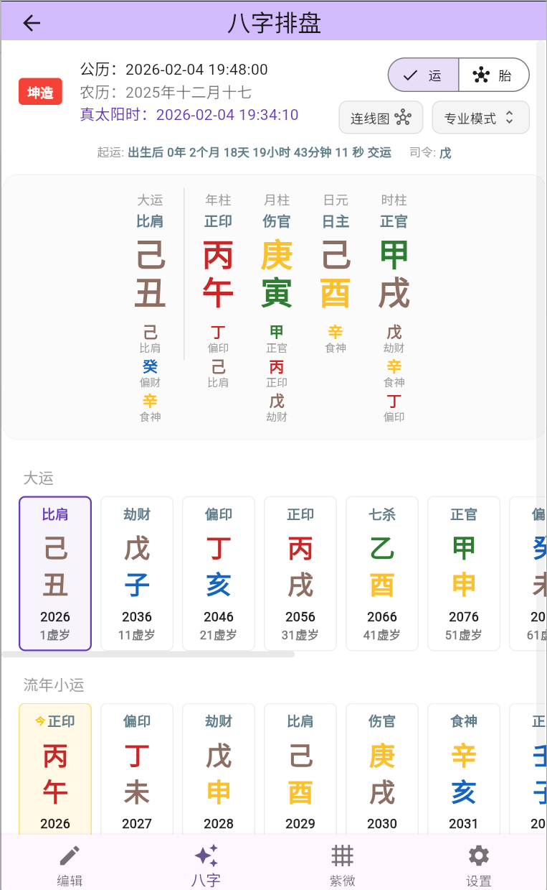
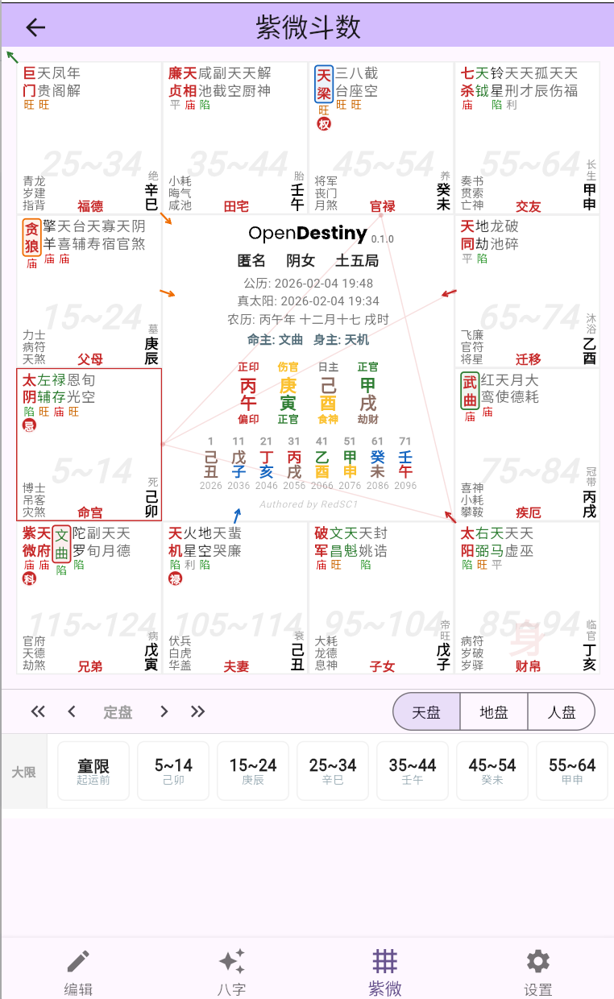

<p align="center">
  
</p>

<h1 align="center">🔮 OpenDestiny</h1>

<p align="center">
  <em>一个用 Flutter 构建的现代化、专业级中国传统术数（紫微斗数与八字）全平台排盘应用。</em>
</p>

<p align="center">
  
  
  
</p>

[**English Version**](README_EN.md)

---

## 🌟 项目简介

**OpenDestiny** 是一款界面精美、交互流畅的跨平台中国传统星命术数应用。目前核心聚焦于：**八字（四柱预测学）**与**紫微斗数**。

建立在极致解耦、纯 Dart 编写的核心引擎之上（`sxwnl_spa_dart`, `bazi_core`, `ziwei_core`），OpenDestiny 能够提供长达约 6,000 年（公元前 1000 年至公元 5000 年）的**高精度**真太阳时校准，为你呈现一个无状态的、极速的、且完全本地化离线运算的专业排盘体验。

这不仅是一个开箱即用的应用，更是底层星命引擎在业务层的 UI 实践标杆。

---

## 📱 界面预览 (Screenshots)

<p align="center">
  
  
  
</p>
<p align="center">
  
</p>

---

## ✨ 核心特性

*   **🌌 专业的紫微斗数与八字联动**
    *   全景式的【天盘、地盘、人盘】任意切换。
    *   由独立运行时管理器支持的多层级（流大限、流年、流月、流日、流时）状态流转引擎。
    *   严谨的天文学节气计算，自带经纬高精度的真太阳时（Apparent Solar Time）与早晚子时切分功能。
*   **🎨 现代而克制的 UI 设计**
    *   告别传统预测软件花哨冗余的设计，采用极简的现代化卡片、玻璃拟态动画及专属调色的深色模式。
    *   响应式网格布局，适配手机、平板及电脑屏幕而不重叠溢出。
*   **📐 稳如磐石的应用架构**
    *   业务逻辑全部交由 `Riverpod` + `Freezed` 树状状态管理，数据层及 UI 层完美分离。
    *   复杂盘面数据的安全存取靠 `json_serializable` 护航。
*   **🌐 真正的一次编写，全平台运行**
    *   核心算法 100% 纯 Dart 语言实现，没有一丝一毫的原生平台强依赖（C/C++ 或 JNI）。
    *   开箱即支持：Android, iOS, Windows, macOS, Linux 及 Web 浏览器端。

---

## 🏛️ 引擎生态矩阵

OpenDestiny 的流畅运转，主要得益于我们向开源社区独立发行的三套核心底层库（目前已全部同步上架 Pub.dev）：

1.  📦 **[`sxwnl_spa_dart`](https://pub.dev/packages/sxwnl_spa_dart)** (v0.16.0) - 基于**高精度历法算法**及太阳视运动规律的天文学最底层工具库。
2.  📦 **[`bazi_core`](https://pub.dev/packages/bazi_core)** (v0.6.0) - 八字核心引擎，负责农历节气查询、五行四柱排法及流运神煞起例。
3.  📦 **[`ziwei_core`](https://pub.dev/packages/ziwei_core)** (v0.11.0) - 极具配置化野心的紫微斗数引擎，负责一百多颗星曜的动态安星轨辙与四化演变。

---

## 🚀 快速上手

### 环境要求

*   Flutter SDK `^3.16.0` 及以上版本
*   Dart SDK `^3.1.0` 及以上版本

### 编译与运行

1.  **克隆仓库代码**：
    ```bash
    git clone https://github.com/RedSC1/opendestiny-flutter.git
    cd opendestiny-flutter
    ```

2.  **获取依赖库**：
    ```bash
    flutter pub get
    ```

3.  **运行代码生成器（Riverpod / Freezed 必跑步骤）**：
    ```bash
    dart run build_runner build --delete-conflicting-outputs
    ```

4.  **跑起来体验**：
    ```bash
    flutter run
    ```

---

## 🏗️ 目录树

```text
opendestiny-flutter/
├── android/            # 安卓原生构建宿主
├── ios/                # 苹果原生构建宿主
├── assets/             # 自定义字体、图片图标及水印资产
├── lib/
│   ├── core/           # 整个 App 的通用配置、路由、UI 规范与持久化封装
│   ├── data/           # 全局仓储（如内置城市列表）
│   ├── features/       # 🔥 按业务垂直划分的核心特性模块 (bazi, ziwei, profile, settings)
│   ├── models/         # 贯穿全域的领域实体（如：档案信息 Destiny Profile）
│   └── main.dart       # Flutter 启动入口点
└── pubspec.yaml        # 依赖配置文件
```

---

## 📝 路线图与愿景 (Roadmap)

*   [x] 三套核心命理引擎闭环（`ziwei_core`, `bazi_core`）与解耦。
*   [x] 抽离核心逻辑并完成 `pub.dev` 多包矩阵发布，建立依赖规范。
*   [ ] 完善应用内容的国际化多语言体系 (i18n)。
*   [ ] 盘面的深层交互设计探讨（诸如：十二宫位双击弹层、星曜详细释义卡片等）。
*   [ ] “档案库”架构云端云同步存储预研。

---

## ⚖️ 免责声明

本软件及底层源码仅供天文历法研究、传统文化架构保护、非盈利性学术探讨及程序设计交流使用。软件输出的任何结果，皆基于古代经验统计学的程序化重现，没有任何神鬼玄幻性质。
项目作者及其维护者，对任何人因盲目轻信本软件产生的一切生活决策、经济活动预测及人身安全问题，概不承担任何直接或连带法律责任。
**请相信科学，命运始终掌握在你自己的手里。**

---

## 📜 开源协议

本项目遵循 **MIT License** 开源协议释放。具体内容请参见根目录下的 [LICENSE](LICENSE) 文件。
如果这个项目帮助到了你的技术学习，或者为你平时查阅星盘提供了便利，不妨随手点个 **⭐ Star**！
