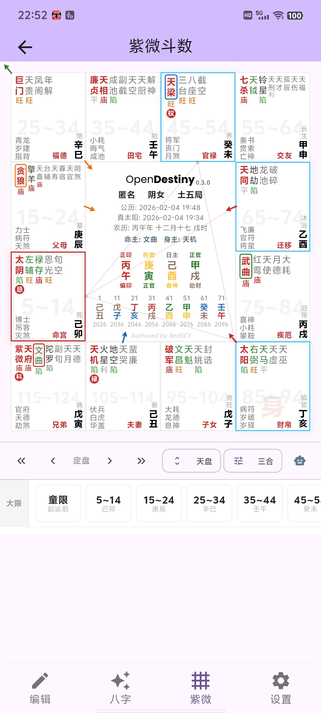
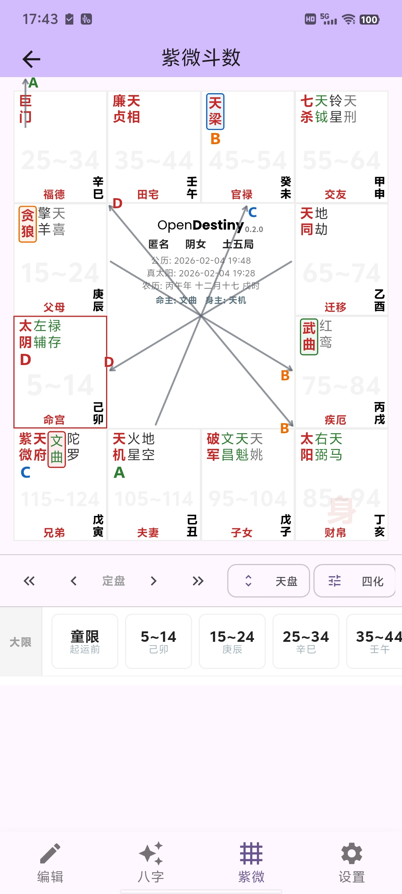

<p align="center">
  
</p>

<h1 align="center">🔮 OpenDestiny</h1>

<p align="center">
  <em>一个用 Flutter 构建的现代化、专业级中国传统术数（紫微斗数与八字）全平台排盘应用。更多内容正在开发中</em>
</p>

<p align="center">
  
  
  
</p>

[**English Version**](README_EN.md)

---

## 🌟 项目简介

**OpenDestiny** 是一款基于 Flutter 构建的现代化、专业级中国传统术数（紫微斗数与八字）全平台排盘应用。

它不仅是一个界面精美、交互流畅的工具，更是底层星命引擎矩阵在业务层的 **UI 实践标杆**。通过将严谨的现代软件工程与古老的术数逻辑相结合，OpenDestiny 旨在为传统文化提供一个**数字化存档**与**实证研究**的精密载体。

### 💎 技术方案亮点

*   **🛠️ 高度可移植逻辑**：底层逻辑完全建立在纯 Dart 编写的核心库矩阵之上。实现 100% 逻辑跨平台与全离线高性能运算，不产生任何原生平台二进制依赖。
*   **⏳ 宽幅时间轴支持**：系统理论支持公元前 1000 年至公元 9999 年*的全量排盘与推演，覆盖绝大部分有史可考及未来的历法跨度。
*   **🎯 真太阳时校准**：内置高精度天文算法，实现经纬度级别的真太阳时（Apparent Solar Time）校准及早晚子时逻辑，确保计算结果的数据一致性。
*   **🧪 中立逻辑验证**：将传统术数规则解构为可编程逻辑。为研究者提供中立的计算平台，便于基于历史数据进行客观的**证明或证伪**。

**项目使命**：本项目主要作为传统命理学与预测学的电子化存档。我们不预设其理论的有效性，仅通过现代软件工程手段提供一个中立、精确的计算平台，旨在为相关领域的复盘研究提供技术支撑，使术数研究能够基于客观数据进行逻辑层面的审视。

> 📖 **[开发者笔记 (Developer's Note)](https://github.com/RedSC1/ziwei_core/blob/main/developer's_note.md)**：深度了解作者对玄学与程序设计的“理智”思考。

---
> \*注：受地球自转 ΔT 长期漂移的影响，公元 2025 年以后的天文时间预测精度会随时间推移逐渐降低。

## 📱 界面预览 (Screenshots)

<p align="center">
  
  
  
</p>
<p align="center">
  
  
</p>

---

## ✨ 核心特性

*   **📊 专业排盘逻辑**
    *   **多维度支持**：涵盖紫微斗数（天/地/人盘，三合/飞星/四化模式切换）与八字命理（刑冲克害可视化连线、神煞起例）。
    *   **全状态联动**：支持大限、流年、流月、流日、流时等层级的动态流转。
    *   **高精度历法**：基于天文算法校准真太阳时，严格处理早晚子时切换，支持万年范围的推算。
*   **🛠️ 技术架构选型**
    *   **状态管理**：全量使用 `Riverpod` + `Freezed` 驱动，确保业务逻辑与 UI 层严格解耦。
    *   **类型安全**：利用 `json_serializable` 处理复杂的命理数据序列化。
*   **🌐 跨平台部署**
    *   **纯 Dart 引擎**：核心算法不依赖 C/C++ 或 JNI，无任何原生平台强依赖，具备原生级别性能。
    *   **多端覆盖**：一套代码直接编译为 Android, iOS, Windows, macOS, Linux 及 Web 应用。

---

## 🏛️ 项目架构与组件矩阵

### 🏗️ 逻辑架构图
本项目遵循 **计算与 UI 分离** 的设计原则，所有的命理逻辑均由底层的 Dart 核心库处理，Flutter 仅作为渲染层：

```text
[ 用户输入 ] ──► [ BirthData Model ] ──► [ Riverpod Providers ]
                                               │
                                               ▼
[ Flutter UI ] ◄── [ Immutable State ] ◄── [ Core Engines ]
(Material 3)        (Freezed/Models)       (Bazi/Ziwei/SPA)
```

### 📦 核心依赖组件
OpenDestiny 基于以下独立维护并发布于 Pub.dev 的核心库构建：

1.  📦 **[`sxwnl_spa_dart`](https://pub.dev/packages/sxwnl_spa_dart)** (v0.17.0)：提供高精度历法计算与太阳视运动规律的天文学基础。
2.  📦 **[`bazi_core`](https://pub.dev/packages/bazi_core)** (v0.6.1)：八字逻辑库，处理农历转换、五行排盘及流运计算。
3.  📦 **[`ziwei_core`](https://pub.dev/packages/ziwei_core)** (v0.12.1)：紫微斗数规则库，负责星曜排布、星盘状态流变及四化演变。

### 📂 目录结构规范
采用 **Feature-first (功能优先)** 的组织方式，便于水平扩展新的术数模块：

```text
lib/
├── core/           # 路由、主题、持久化及通用工具类
├── data/           # 静态资源与本地数据库映射 (如：内置城市库)
├── features/       # 🚀 核心业务模块 (bazi, ziwei, profile, settings)
├── models/         # 跨模块共享的领域实体 (如：BirthData)
└── main.dart       # 应用入口，ProviderScope 全局状态根
```

---

## 🚀 核心功能深度解析

### 1. 开放式流派自定义 (Custom Profiles)
不同于市面上大多数“写死逻辑”的排盘软件，OpenDestiny 提供了高度开放的流派定制链路。用户可以针对特定的学术传承进行深度配置：
*   **四化规则自定义**：通过可视化表格或标准 JSON 协议，手动编辑十天干对应的“禄、权、科、忌”星曜映射。
*   **星曜亮度体系**：支持自定义 12 地支对应的星曜亮度等级（庙、旺、得、利、平、不得、陷），并可自由定义亮度标签及其视觉权重。
*   **跨设备配置迁移**：所有自定义流派均可一键生成 JSON 协议，通过系统分享渠道实现“独门规则”的秒级分发与导入。

### 2. 数字化命例管理 (Case Management)
建立了一套标准的数字化命例归档方案，解决多端数据碎片化问题：
*   **全量 JSON 导出/导入**：支持将本地库中的命例（包含姓名、生辰、地理坐标等）以结构化 JSON 格式导出，便于二次开发或跨平台手动同步。
*   **多维度分享链路**：利用 Flutter 全平台特性，支持将命例或流派配置通过文件、二维码或系统剪贴板进行分发。
*   **高精度地理库**：内置经过校准的城市经纬度数据库，自动匹配时区偏移与真太阳时修正基准。

### 3. 实验性：八字神煞模块 (Experimental Features)
本项目目前正在探索将传统神煞计算转化为程序化逻辑的路径：
*   **神煞矩阵**：初步集成了包括天乙贵人、驿马、空亡、魁罡等在内的核心神煞算法。
*   **工程说明**：此模块目前标记为“实验性”，核心在于探索算法的稳健性。由于神煞规则在不同流派中存在巨大差异，目前结果仅供工程参考，暂未经过大规模人工考古校对。

### 4. 高级历史历法支持 (Historical Chronology)
*   **双模式年份显示**：支持在**天文纪年**（包含 0 年与负数）与**历史纪年**（公元前/BC 格式）之间一键切换，确保古代命盘分析的严谨性。
*   **历法保护机制**：内置历史历法红区预警，自动处理武则天改历等特殊历史时期的月份偏移。

---

## 🛠️ 开始使用 (Quick Start)

为了确保命理计算的严谨性与逻辑的一致性，本项目在开发过程中遵循以下规范：

### 自动化测试
运行单元测试以验证底层逻辑输出：
```bash
flutter test
```

### 代码生成
本项目大量使用代码生成技术（Riverpod Generator, Freezed, Json Serializable），修改模型后请运行：
```bash
dart run build_runner build --delete-conflicting-outputs
```

### 数据维护工具
在 `tool/` 目录下包含了一些基础数据处理工具，例如城市数据库的生成：
```bash
dart run tool/generate_cities.dart
```

> 💡 欲深入了解项目设计细节、Provider 缓存机制及依赖管理策略，请阅读：**[架构设计文档 (ARCHITECTURE.md)](./ARCHITECTURE.md)**。

---

## 🚀 快速上手
... (保留原来的安装步骤)
### 环境要求

*   Flutter SDK `^3.16.0` 及以上版本
*   Dart SDK `^3.1.0` 及以上版本

### 编译与运行

1.  **克隆仓库代码**：
    ```bash
    git clone https://github.com/RedSC1/opendestiny-flutter.git
    cd opendestiny-flutter
    ```

2.  **获取依赖库**：
    ```bash
    flutter pub get
    ```

3.  **运行代码生成器（Riverpod / Freezed 必跑步骤）**：
    ```bash
    dart run build_runner build --delete-conflicting-outputs
    ```

4.  **运行程序**：
    ```bash
    flutter run
    ```

---

## 🏗️ 目录树

```text
opendestiny-flutter/
├── android/            # 安卓原生构建宿主
├── ios/                # 苹果原生构建宿主
├── assets/             # 自定义字体、图片图标及水印资产
├── lib/
│   ├── core/           # 整个 App 的通用配置、路由、UI 规范与持久化封装
│   ├── data/           # 全局仓储（如内置城市列表）
│   ├── features/       # 🔥 按业务垂直划分的核心特性模块 (bazi, ziwei, profile, settings)
│   ├── models/         # 贯穿全域的领域实体（如：档案信息 Destiny Profile）
│   └── main.dart       # Flutter 启动入口点
└── pubspec.yaml        # 依赖配置文件
```

---

## 📝 路线图与愿景 (Roadmap)

*   [x] 三套核心命理引擎闭环（`ziwei_core`, `bazi_core`）与解耦。
*   [x] 抽离核心逻辑并完成 `pub.dev` 多包矩阵发布，建立依赖规范。
*   [ ] 完善应用内容的国际化多语言体系 (i18n)。
*   [ ] 盘面的深层交互设计探讨（诸如：十二宫位双击弹层、星曜详细释义卡片等）。

---

## ⚖️ 免责声明

本软件及底层源码仅供天文历法研究、传统文化架构保护、非盈利性学术探讨及程序设计交流使用。软件输出的任何结果，皆基于古代经验统计学的程序化重现，没有任何神鬼玄幻性质。
项目作者及其维护者，对任何人因盲目轻信本软件产生的一切生活决策、经济活动预测及人身安全问题，概不承担任何直接或连带法律责任。
**请相信科学，命运始终掌握在你自己的手里。**

---

## 📜 开源协议

本项目遵循 **MIT License** 开源协议。具体内容请参见根目录下的 [LICENSE](LICENSE) 文件。
如果这个项目帮助到了你的技术学习，或者为你平时查阅星盘提供了便利，不妨随手点个 **⭐ Star**！
